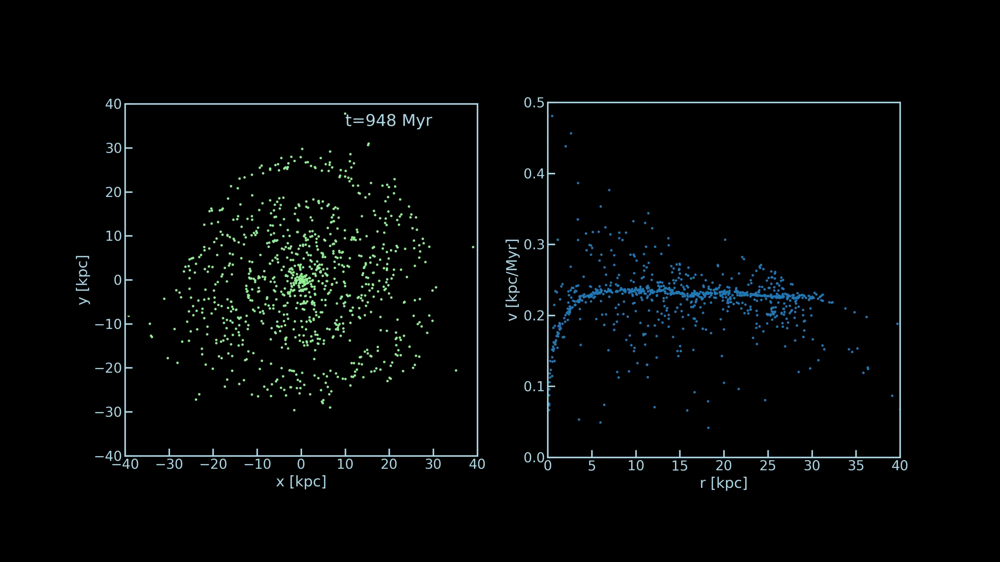

# Galaxy N-body simulation
11/28/2020
Yukei S. Murakami ,UCB (sterling.astro@berkeley.edu)


(for a video version of this sample output, please visit: https://youtu.be/9lIqs2ast2k)

This is a prototype version of an introductory N-body simulation (2D) with a Milky-Way-like galaxy density profile.<br>
There are two main code files (jupyter notebook): ```Density_profile_prep.ipynb``` and ```Simulation.ipynb```.


**note: this repository does not include ```data/``` and ```ani/``` folders where data and aminations are saved. please prepare these folders on your own.**


## ```Density_profile_prep.ipynb```: 
In this simulation, to make the code run faster and coding easier, we assume a static global mass density distribution.<br>
That is, we only simulate N free-moving objects on a pre-determined gravitational potential. This is not perfect because the localization of gravitational potential is much more diluted, but the results are still fun to look at and meaningful for the educational purposes.

To fully make use of this pre-determined gravitational potential, we prepare a pre-calculated set of enclosed mass $M_\text{in}(r)$ at radius r on the galactic plane. This can be done by integrating the density profile inside the spherical shell at radius r.
We use the density model by McMillan 2011 (https://doi.org/10.1111/j.1365-2966.2011.18564.x), and the process of density calculation & integration can be found in the notebook.

## ```Simulation.ipynb```
This jupyter notebook contains main parts of simulation. It contains various tools, such as an initial condition preperator, a Force calculator, an RK4 calculator, the main simulator, and an animator. Following each step should prepare users to understand and run an N-body simulation.
